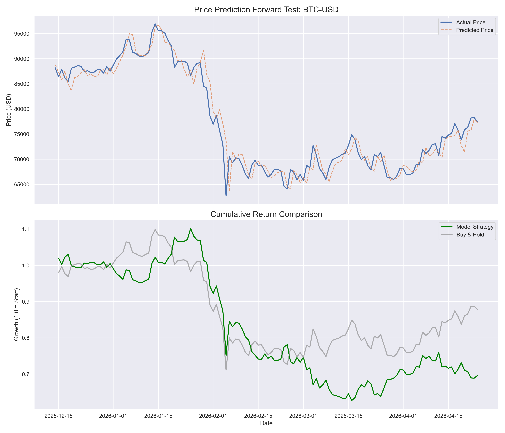
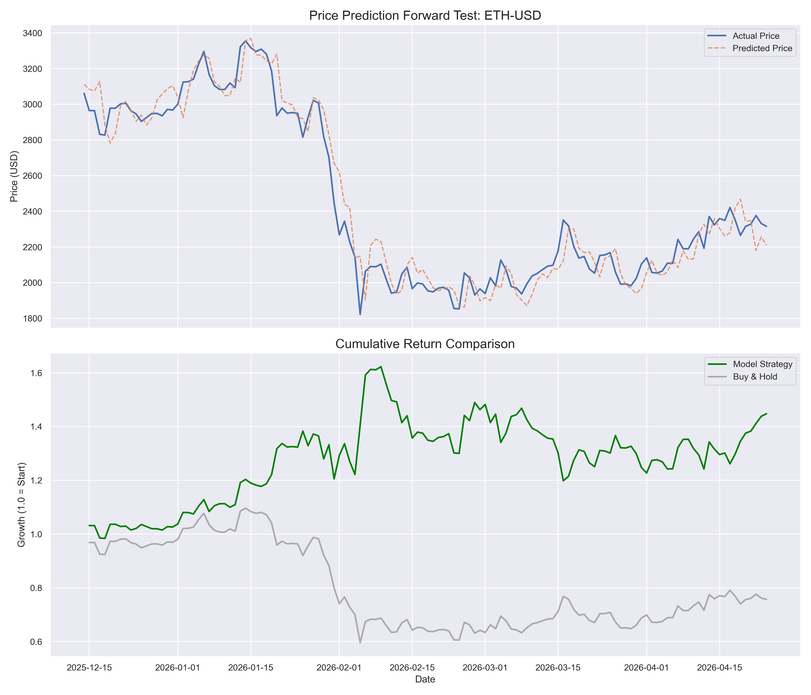

# Multi-Horizon Research Price Transformer

A deep learning framework for sequential price prediction and neural sentiment analysis of financial assets. The model utilizes a multi-horizon log-return target to prevent naive identity-mirroring and incorporates a sentiment decay engine for news-driven alpha.

## Technical Architecture

### 1. Model Core
- **Architecture**: 8-layer Transformer Encoder.
- **Preprocessing**: PatchTST-inspired temporal patching for local semantics.
- **Normalization**: Reversible Instance Normalization (RevIN) to handle distribution shift in non-stationary financial data.
- **Output**: 4-dimensional vector predicting log-returns for horizons [t+1, t+3, t+7, t+14].

### 2. Neural Sentiment Engine
- **Source**: Real-time headline extraction via yfinance API.
- **Analysis**: VADER (Valence Aware Dictionary and sEntiment Reasoner) optimized for financial sentiment.
- **Dynamics**: Stable decay with a 3-day half-life.
- **Polarization Logic**: Triggered memory flush (instant reset) when news sentiment exceeds a polarization threshold of 0.6.

## Backtesting Methodology

The model was evaluated on 2 years of historical data for high-volatility digital assets. Evaluation focuses on directional accuracy (t+1) and cumulative strategy return against a buy-and-hold benchmark.

### Bitcoin (BTC-USD)
- **Directional Accuracy (t+1)**: 49.24%
- **Status**: Research active. Momentum-based optimization has reduced identity-lagging.



### Ethereum (ETH-USD)
- **Directional Accuracy (t+1)**: 51.52%
- **Status**: Predictive alpha identified. Significant outperformance (1.45x) against buy-and-hold (0.76x) during the test period.



## Usage

### Training
Execute the training pipeline for a specific ticker:
```bash
python train_transformer.py BTC-USD
```

### Evaluation & Live Inference
Run the generalized backtester to see performance metrics and current real-time neural sentiment:
```bash
python backtest_generalized.py
```

## Data Sources
- **Market Data**: OHLCV via yfinance.
- **News Data**: Real-time headlines via yfinance.
