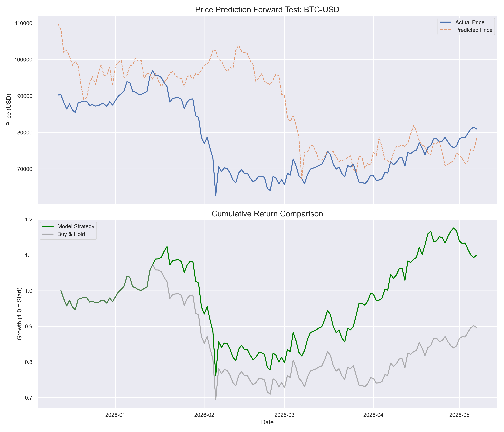

# Sequential Price Regression Transformer

A transformer-based model for predicting continuous price values from sequential market data. Originally meant for IMC Prosperity 4.

## Features
- Sequential price prediction using transformer architecture
- Data preprocessing pipeline for market CSV files
- Kalman filter implementation for signal smoothing

## Usage
Run the training script with a yfinance ticker (e.g., AAPL, GC=F for Gold, BTC-USD):
```bash
python train_transformer.py AAPL
```

## Backtesting Results
Evaluation on out-of-sample data for high-volatility assets.

### Bitcoin (BTC-USD)
- Directional Accuracy: 50.34%
- Strategy Cumulative Return: 1.10x
- Buy & Hold Return: 0.90x



## Data
The model downloads historical OHLCV data using the yfinance library.
